# Library Management System - Docs

## Context diagram

```mermaid
graph RL

    %% System actors
    User(("👤<br>User")):::actor

    %% System - Use case container
    subgraph System["Library Management System"]
    end

    %% Interactions
    User -- Requests --> System
    System -- Data --> User

    %% Style
    classDef actor stroke:none,fill:none,font-size:20px
```



## Use Case diagram

```mermaid
graph LR

    %% System actors
    User(("👤<br>User")):::actor

    %% System - Use case container
    subgraph "Library Management System"

        space[ ]:::hide

        UC1([Create a book])
        UC2([List books])
    end

    %% Relationship
    User ---> UC1
    User ---> UC2

    %% Style
    classDef hide display:none;
    classDef actor stroke:none,fill:none,font-size:20px
```



## High-level view

```mermaid
graph LR

    %% System actors
    User(("👤<br>User")):::actor

    %% System - Use case container
    subgraph "Library Management System"
        
        %% Internal components
        API["<b>REST API</b><br/>(.NET / C#)"]
        Database[("<b>Database</b><br/>(MSSQL)")]
        
        %% Internal dataflow
        API -- "SQL" --> Database
    end

    %% Interactions
    User -- "HTTPS Request" --> API
    API -- "HTTPS Response (JSON)" --> User

    %% Style
    classDef actor stroke:none,fill:none,font-size:20px
```



## Detailed view - REST API (.NET / C#)

```mermaid
graph LR

    %% System actors
    User(("👤<br>User")):::actor
    Database[("<b>Database</b><br/>(MSSQL)")]

    %% REST API subsystem follows Clean Architecture principles
    subgraph "REST API (.NET / C#)"
        
        %% Api Layer
        subgraph "Api Layer"
            Controllers["<b>Controllers</b><br><small>HTTP Endpoints</small>"]
        end

        %% Application Layer
        subgraph "Application Layer"
            UseCases["<b>Use Cases</b><br><small>Business Logic</small>"]
            RepoInt["<b>Repository Interfaces</b><br><small>Abstractions</small>"]
            DTOs["<b>DTOs</b><br><small>Request/Response Objects</small>"]
        end

        %% Domain Layer
        subgraph "Domain Layer"
            Models["<b>Models</b><br><small>Core Data Structure</small>"]
        end

        %% Infrastructure Layer
        subgraph "Infrastructure Layer"
            DbContext["<b>EF Core</b><br><small>DbContext</small>"]
            RepoImpl["<b>Repository Implementations</b><br><small>Data Access</small>"]
        end

    end

    %% Interactions
    User -- "HTTPS Request" --> Controllers
    Controllers -- "HTTPS Response (JSON)" --> User
    Controllers <-- "DTOs" --> UseCases
    RepoImpl -- Manipulate --> Models
    UseCases <-- "Models" --> RepoInt
    UseCases -- Mapping --> Models
    RepoInt -. "Implemented by" .-> RepoImpl
    RepoImpl  --> DbContext
    DbContext -- "SQL" --> Database

    %% Style
    classDef actor stroke:none,fill:none,font-size:20px
```



## Class diagram


## Dynamic view - Create a new valid book

```mermaid
sequenceDiagram
    autonumber

    actor User
    participant BookController
    participant CreateBookUseCase
    participant Book as Book (Domain Model)
    participant IBookRepository
    participant BookRepository
    participant Database

    User ->> BookController: POST /api/books (CreateBookRequestDTO bookDto)

    activate BookController
    BookController ->> CreateBookUseCase: Execute(bookDto)
    activate CreateBookUseCase

    Note over CreateBookUseCase, Book: Mapping request DTO to model
    CreateBookUseCase ->> Book: Create new instance 
    Book -->> CreateBookUseCase: bookModel instance

    Note over CreateBookUseCase, Book: Checking the validity of the new book
    CreateBookUseCase ->> Book: bookModel.IsPublicationYearValid() & bookModel.IsISBNValid()
    Book -->> CreateBookUseCase: true

    Note over CreateBookUseCase, Database: Making the new book persistent
    CreateBookUseCase ->> IBookRepository: CreateAsync(bookModel)
    
    IBookRepository ->> BookRepository: CreateAsync(bookModel)

    activate BookRepository
    BookRepository ->> Database: EF Core SaveChanges
    Database -->> BookRepository: Success
    BookRepository -->> CreateBookUseCase: Return persisted model
    deactivate BookRepository

    Note over CreateBookUseCase: Mapping model to response DTO
    CreateBookUseCase -->> BookController: Success (CreateBookResponseDTO)
    
    BookController -->> User: 201 Created (JSON)

    deactivate CreateBookUseCase
    deactivate BookController
````
